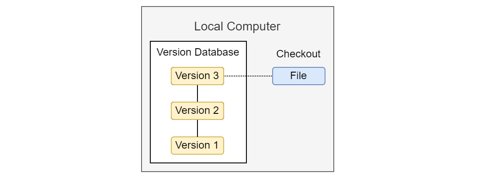
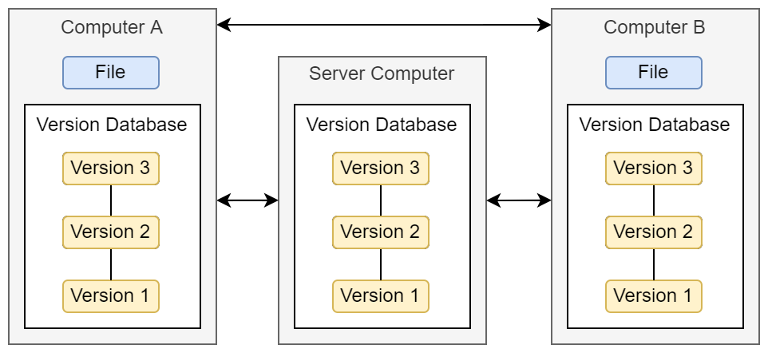

---
title: 
- Git in 15 minutes
author:
- Dr. Maximilian Hindermann
institute: 
- RISE and UB
theme: 
- Metropolis
date: 
- October 13, 2022

---

# Today's Goal

- Get you in a position to decide if Git might be useful for your work.

# What is Git?

- Git is a distributed version control system (VCS).
- A VCS is "a system that records changes to a file or set of files over time so that specific versions can be recalled later" (Chacon & Straub 2014: 10).
- Git is very well suited for text-like data such as code, but of course also for text-like data such as:
    - an ALTO-XML file encoding the transcript of a medieval manuscript
    - a CSV file recording numerical weather data for Basel
    - a JSON-LD file containing a Tropy database
    - an SVG file of a research project's fancy new logo
- Git is less well suited for binary data such as audio data, images or video (changes in these files are opaque).

# Local version control

- Solves the problem of error-prone manual versioning of files.

# Centralized version control

- Solves the problem of how to work on the same files together on different computers.

# Distributed version control

- Solves the problem of being dependent on central server for work and backup.

# Using Git

- command line; GitLab, GitHub...

# Git(Lab) at Unibas

Several GitLab instances at Unibas but none run as official university-wide service:

- https://git.scicore.unibas.ch/
- https://gitlab.psychologie.unibas.ch/
- https://gitlab.switch.ch/ub-unibas/
- https://gitlab.its.unibas.ch/

If there are instances missing please get in touch!

# Looking at a sample GitHub repository

The GitHub repository for these slides is available at: https://github.com/MHindermann/slides/tree/main/2022-10-13%20RDMN%20Coffee%20Lecture%20on%20Git

# Further reading

- Tons of material online
- [Scott Chacon and Ben Straub (2014): Pro Git](https://git-scm.com/book/en/v2)
- Bern Öggl and Michael Kofler (2022): Git. Projektverwaltung für Entwickler und DevOps-Teams

# Contact

## Via email
- rise@unibas.ch
- maximilian.hindermann@unibas.ch

## On GitHub
- https://github.com/RISE-UNIBAS 
- https://github.com/MHindermann 